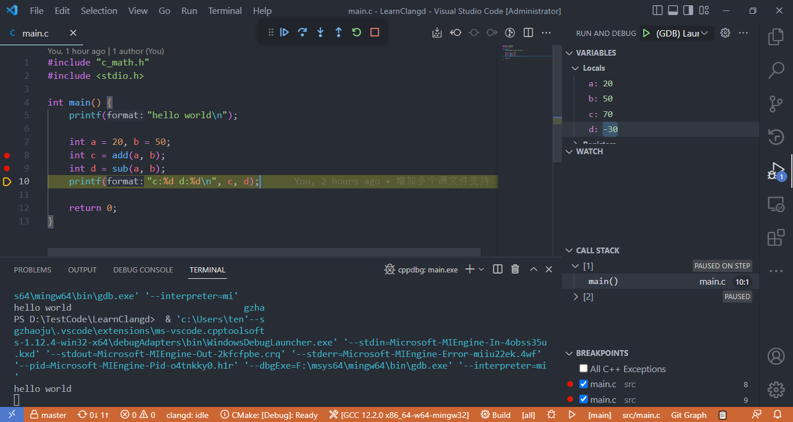

# Vscode_Mingw_GDB_CMake_Clangd_Demo

## 基本说明
本Demo用于搭建一个基于VSCode+Clangd+CMake+Mingw64工具链的C/C++开发环境，具备智能提示、引用跳转、可视化调试等功能。

主要用到的工具如下：

* [VSCode编辑器](https://code.visualstudio.com/)
* [msys2+mingw64工具链](https://www.msys2.org/)
* [CMake构建系统](https://cmake.org/)
* [VSCode插件Clangd (使用智能提示、引用跳转等功能)](https://marketplace.visualstudio.com/items?itemName=llvm-vs-code-extensions.vscode-clangd)
* [VSCode插件C/C++ (禁用智能提示，仅使用调试功能)](https://marketplace.visualstudio.com/items?itemName=ms-vscode.cpptools)
* [VSCode插件CMake Tools](https://marketplace.visualstudio.com/items?itemName=ms-vscode.cmake-tools)
* [VSCode插件CMake Language Support](https://marketplace.visualstudio.com/items?itemName=josetr.cmake-language-support-vscode)

## Snapshot
